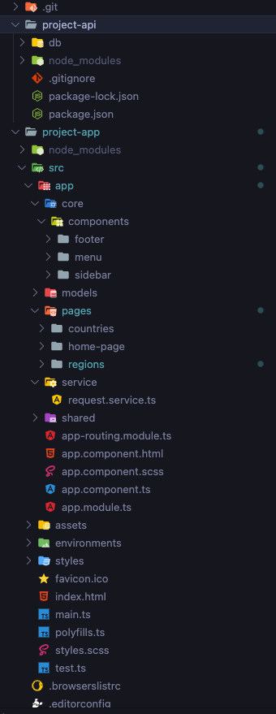
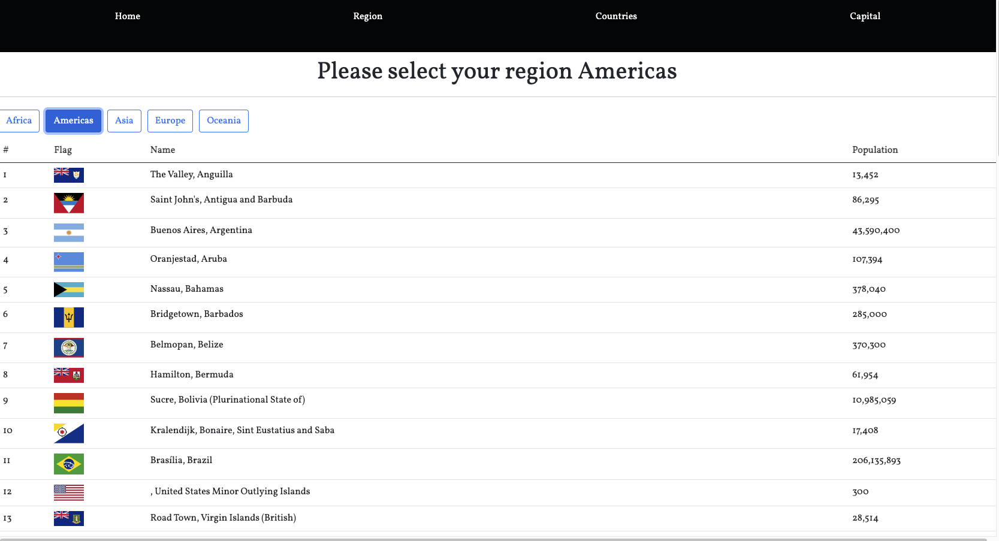
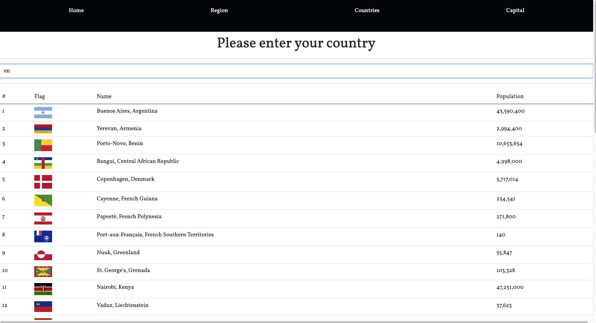
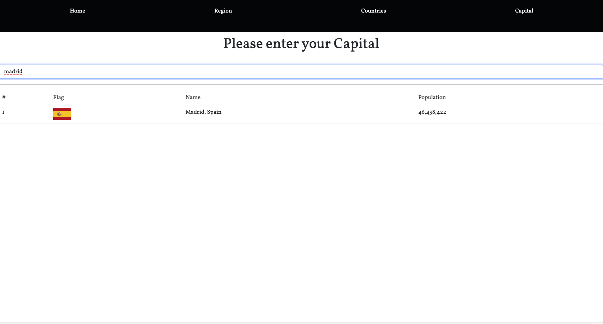

# Angular project created for practising endpoints and testing fake API

The App is divided into 4 sections and the folder structure is as follows:

This project is divinded into 2 main parts:

     - Project-Api which contains a fake API created for testing. This folder includes basically the name of the routes located in the menu component.

     - Project-App contains all the information of the front page.

        * Core contains all the components that will be present in all the screens of the application, basically the menu in this case but the footer is also created but not displayed. Interfaces are created in folder models. Also has a services defined in environment.ts.

        * Pages hast 3 main parts:

            > Countries

            > home-page

            > regions

        Each folder has a separate module and the 3 folers are consuming one service created at the same level, fetching the same API requesting different information which is contained in the folder services--> request.service.

We will be importing all the modules into app.module and also implement lazy loading in the app.routing.module

All the app looks as follows:

1 - Home view 

This screen is the landing page.

2 - Region section

This section includes 5 buttons located at the top of the page.

    - Select between the 5 continents and all the info will be displayed

3 - Countries section

    - Entering a value it shows all the countries containing those letters.
    
4 - Capital sections

    - Enter the value of capital and it returns the capital of every country of the world.
