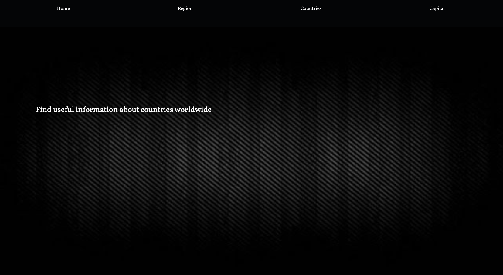

# Angular project created for practising endpoints and testing fake API

The App is divided into 4 sections:

1 - Home view 

2 - Region section

    - Select between the 5 continents and all the info will be diaplayed

3 - Countries section

    - Enter your country or if you are not sure 
